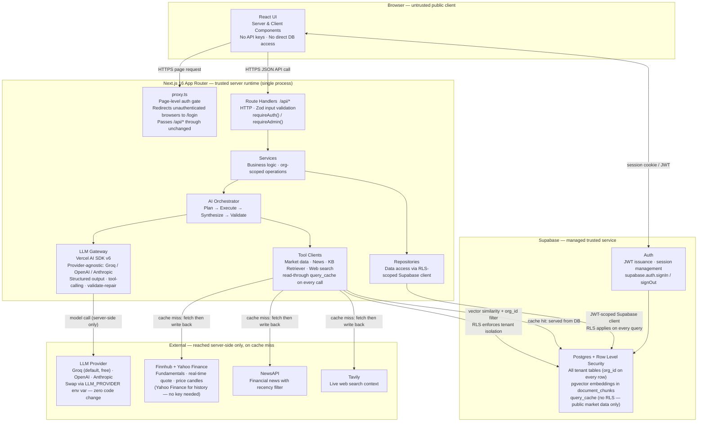
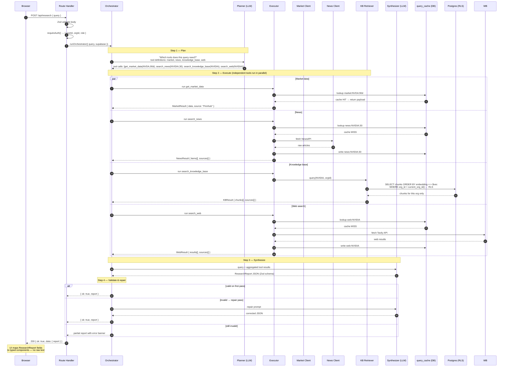
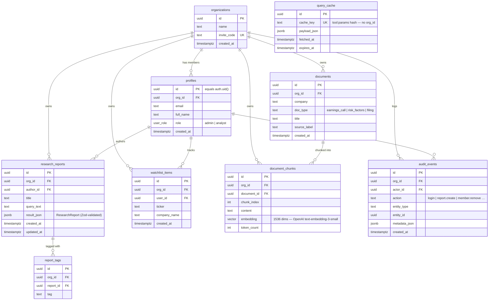
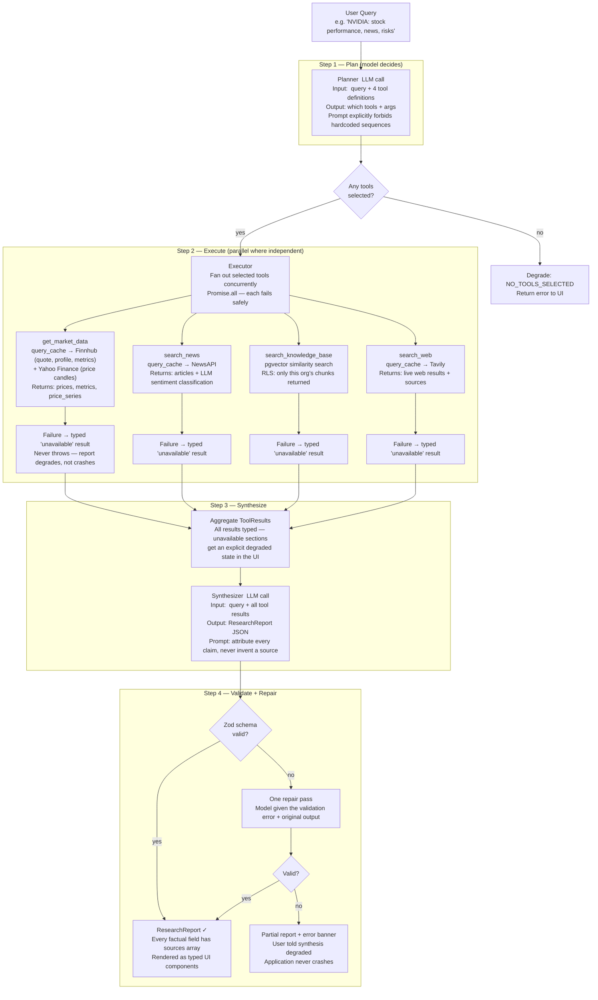
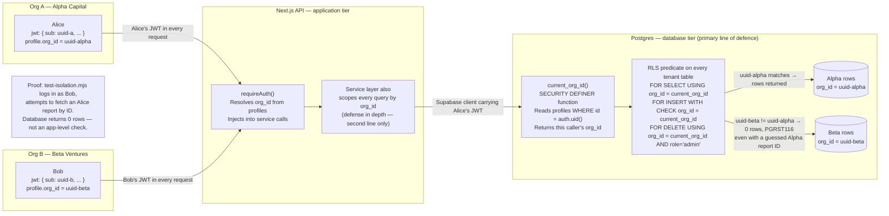

# ARCHITECTURE — Klypup Investment Research Dashboard

> Five required diagrams + API reference. All diagrams are authored in Mermaid.

---

## Diagram 1 — System Architecture

Shows every component and the trust boundaries between them. The browser is the only untrusted zone; keys never leave the server runtime; external APIs are reached only on a cache miss.



---

## Diagram 2 — Research Query Data Flow

Traces a single `POST /api/research` request from browser to structured report, showing every step including the cache, parallel tool execution, and the validate-and-repair loop.



---

## Diagram 3 — Entity-Relationship Diagram

Every tenant-owned table carries `org_id`. `query_cache` is intentionally not tenant-scoped because it stores only public market/news API payloads, never tenant data.



---

## Diagram 4 — AI Orchestration Flow

The model decides which tools to call; it is never a hardcoded pipeline. Tool failures degrade one section, not the whole report.



---

## Diagram 5 — Multi-Tenant Isolation Proof

Isolation is enforced at the database tier, not only in application code. A forgotten `WHERE org_id` in application code cannot cause a cross-tenant leak because Postgres denies the rows before they leave the database.



---

## API Reference

All endpoints return `{ ok: true, data }` on success or `{ ok: false, error: { code, message } }` on failure. Auth is via session cookie (browser) or `Authorization: Bearer <jwt>` (programmatic).

| Method | Path | Auth | Role | Status codes | Purpose |
|--------|------|------|------|-------------|---------|
| `POST` | `/api/onboarding` | session | any | 200, 400, 409 | Create new org (caller → admin) or join via invite code (caller → analyst). One-time call after first sign-up. |
| `GET` | `/api/me` | session | any | 200, 401, 403 | Current user, profile, org, and role. |
| `POST` | `/api/research` | session | any | 200, 400, 401, 422, 503 | Run the agentic research query. Returns a full `ResearchReport`. |
| `POST` | `/api/research/save` | session | any | 201, 400, 401, 422 | Persist a generated report. |
| `GET` | `/api/research` | session | any | 200, 401 | List org's saved reports. Supports `?tag=` and `?q=` filters. |
| `GET` | `/api/research/:id` | session | any | 200, 401, 404 | Read one report. Re-checked against tenant — guessed IDs return 404. |
| `PATCH` | `/api/research/:id` | session | any | 200, 400, 401, 404, 422 | Update title or tags. |
| `DELETE` | `/api/research/:id` | session | any | 200, 401, 404 | Delete a report. |
| `GET` | `/api/health` | public | — | 200, 503 | DB and LLM gateway reachability. Returns `{ ok, db, llm }`. |
| `POST` | `/api/org/invite` | session | admin | 200, 401, 403 | Return (or generate) the org's invite code. |
| `GET` | `/api/org/members` | session | admin | 200, 401, 403 | List all members of the org. |
| `DELETE` | `/api/org/members/:id` | session | admin | 200, 400, 401, 403, 404 | Remove a member. Cannot remove self. RLS also blocks self-removal at DB tier. |
| `GET` | `/api/market-prices` | session | any | 200, 400, 401 | Live prices, 1D change %, and 30D sparkline series for comma-separated `?tickers=`. Results cached 24h. |
| `GET` | `/api/watchlist` | session | any | 200, 401 | List the caller's watchlist items. |
| `POST` | `/api/watchlist` | session | any | 201, 400, 401, 409, 422 | Add a ticker to the watchlist. 409 on duplicate. |
| `DELETE` | `/api/watchlist/:id` | session | any | 200, 401, 404 | Remove a watchlist item. |

### Standard response envelope

```jsonc
// Success
{ "ok": true, "data": { /* endpoint-specific payload */ } }

// Failure
{
  "ok": false,
  "error": {
    "code": "REPORT_NOT_FOUND",   // machine-readable constant
    "message": "Report not found" // human-readable
  }
}
```

### Error code taxonomy

| HTTP | Codes | When |
|------|-------|------|
| 400 | `VALIDATION_ERROR`, `CANNOT_REMOVE_SELF` | Malformed request or business-rule violation |
| 401 | `UNAUTHORIZED` | No valid session |
| 403 | `FORBIDDEN` | Authenticated but wrong role |
| 404 | `NOT_FOUND` | Resource missing or cross-tenant id (indistinguishable by design) |
| 409 | `DUPLICATE` | Unique constraint violation (e.g. duplicate watchlist ticker) |
| 422 | `VALIDATION_ERROR` | Body fails Zod schema — includes `details` array with field-level errors |
| 503 | `LLM_NOT_CONFIGURED`, `SYNTHESIS_FAILED` | Upstream unavailable or LLM key missing |
